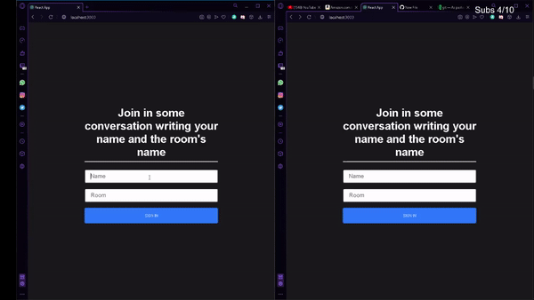

# A real time Chat aplication built in React, Node and Websockets (Socket.io)

Web sockets give to us the oportunity of making real time and fast connections between client and server, but with a
easy way.

To talk with another people, you must be into the same room. There, you can write messages, see who joined and see who left the chat.

